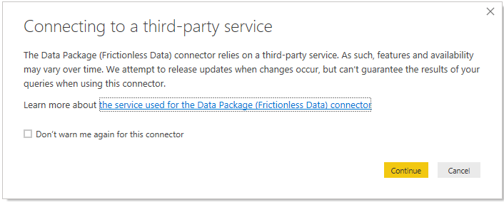

# Data Package Connector (datapackage-connector)

A Power BI [Custom Connector](https://docs.microsoft.com/en-us/power-bi/desktop-connector-extensibility#custom-connectors) based on the [Data Package M (datapackage-m)](https://github.com/nimblelearn/datapackage-m) functions. Data Package Connector enables you to load one or more tables from  [Tabular Data Packages](http://frictionlessdata.io/docs/tabular-data-package/) directly into Power BI through the familiar 'Get Data' experience.

## What is Frictionless Data?

A Tabular Data Package is a simple format for publishing and sharing tabular data. Tabular Data Packages extend and specialise the Data Package specification, and both come under the umbrella of [Frictionless Data](https://frictionlessdata.io/).

Below is the vision statement taken from the Frictionless Data website:

>Frictionless Data shortens the path from data to insight with a collection of [specifications](https://frictionlessdata.io/specs/) and [software](https://frictionlessdata.io/software/) for the publication, transport, and consumption of data. At the heart of our approach is a deep understanding of the multi-faceted nature of data work, and an emphasis on platform-agnostic interoperability. From consumer spreadsheet software, through to cloud-based services for data analysis, the future of data is frictionless.

Visit [https://frictionlessdata.io](https://frictionlessdata.io) to learn more.

## Data Package Connector in Power BI Desktop

  
*Easily load Data Packages through the 'Get Data' UI*

  
*Data Package Connector is stable but it's still under development*  

  
*Specify a valid Data Package identifier and whether to respect the Table Schema*

  
*Connects using anonymous authentication*

  
*Select the tables (i.e. Data Resources) that you want to load/edit and the rest is history*

## Data Package Connector Functions

| Function Name      | Description                                                                 |
| :----------------- | :-------------------------------------------------------------------------- |
| DataPackage.Load   | Returns a Navigation Table (i.e. `table`) that lists the [Data Resources](https://frictionlessdata.io/specs/data-resource/) contained within a Data Package. This function wraps DataPackage.Tables but expects the `ignoreTableSchemaTypes` parameter to be a `text` representation of a logical instead of an actual `logical` value. The `text` value is casted to a `logical` value before calling DataPackage.Tables. See [Data Package M (datapackage-m)](https://github.com/nimblelearn/datapackage-m) to learn more about DataPackage.Tables function.|

### DataPackage.Load

| Parameter              | Type         | Description                                              |
| :--------------------- | :----------- | :------------------------------------------------------- |
| dataPackageIdentifier  | text         | A valid [Data Package Identifier](https://frictionlessdata.io/specs/data-package-identifier/) |
| ignoreTableSchemaTypes | text         | Controls whether the [Table Schema](https://frictionlessdata.io/specs/table-schema/) is applied to the data. This must have a value that can be casted to a logical value using the [Logical.From function](https://docs.microsoft.com/en-us/powerquery-m/logical-from) in the standard Power Query M library e.g. 'true' or 'false'. |

Only data resources that are detected as being tabular (i.e. contain a `table` value in their 'Data' column) are returned by this function.

## Setup

1. Download the [latest release](https://github.com/nimblelearn/datapackage-connector/releases) release.
2. Extract the 'DataPackage.mez' Power BI extension file from the 'distributable' folder.
3. Follow [these](https://docs.microsoft.com/en-us/power-bi/desktop-connector-extensibility) instructions on how to use Power BI Custom Connectors with Power BI Desktop.
4. Follow [these ](https://docs.microsoft.com/en-us/power-bi/service-gateway-custom-connectors) instructions on how to use Power BI Custom Connectors with the Power BI On-premises Data Gateway.

## Try Data Package Connector with the Core Datasets

* [Core Datasets on DataHub](https://datahub.io/core/)
* [Core Datasets on GitHub](https://github.com/datasets/)

## Licensing

This work was created by [Nimble Learn](http://www.nimblelearn.com) and has been published with the MIT License. The full license can be viewed in [plain text](./LICENSE.txt).

## Notes

* When prompted for the 'Privacy Level' choose either 'Public' or 'Organizational'.

* If the field values in a CSV file do not match the expected field type, as defined in the [Table Schema](https://frictionlessdata.io/specs/table-schema/), the invalid values in the column will return an error (Expression.Error). You can get around this by setting the `ignoreTableSchemaTypes` parameter to `true`.

## Known Issues

There are no currently known issues.