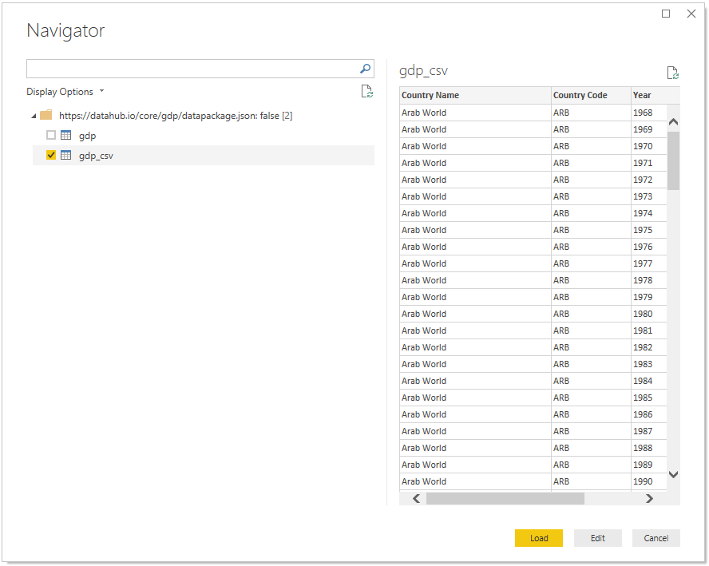

# Data Package Connector (datapackage-connector)

A Power BI [Custom Connector](https://docs.microsoft.com/en-us/power-bi/desktop-connector-extensibility#custom-connectors) based on the [Data Package M (datapackage-m)](https://github.com/nimblelearn/datapackage-m) functions. Data Package Connector enables you to load one or more tables from  [Tabular Data Packages](http://frictionlessdata.io/docs/tabular-data-package/) directly into Power BI through the familiar 'Get Data' experience. It also includes the Data Package M functions library.

Not heard of Power BI? You can learn about it [here](https://docs.microsoft.com/en-us/power-bi/power-bi-overview).


## What is Frictionless Data?


A Tabular Data Package is a simple format for publishing and sharing tabular data. Tabular Data Packages extend and specialise the Data Package specification, and both come under the umbrella of [Frictionless Data](https://frictionlessdata.io/).

Visit [https://frictionlessdata.io](https://frictionlessdata.io) to learn more.


## Data Package Connector in Power BI Desktop


  
*Easily load Data Packages through the 'Get Data' UI*

  
*Data Package Connector is a stable third-party connector*  

  
*Specify a valid Data Package identifier and whether to respect the Table Schema*

  
*Connects using anonymous authentication*

  
*Select the tables that you want to load/edit and the rest is history*

  
*Full support for on demand and scheduled data refresh in the Power BI service (requires a Data Gateway)*

  
*Includes [Data Package M](https://github.com/nimblelearn/datapackage-m) functions for more advanced scenarios*

## Data Package Connector Functions

| Function Name      | Description                                                                 |
| :----------------- | :-------------------------------------------------------------------------- |
| DataPackage.Load   | Returns a Navigation Table (i.e. `table`) that lists the [Data Resources](https://frictionlessdata.io/specs/data-resource/) contained within a Data Package. This function wraps DataPackage.Tables but expects the `ignoreTableSchemaTypes` parameter to be a `text` representation of a logical value instead of an actual `logical` value. The `text` value is casted to a `logical` value before calling DataPackage.Tables.|

### DataPackage.Load

| Parameter              | Type         | Description                                              |
| :--------------------- | :----------- | :------------------------------------------------------- |
| dataPackageIdentifier  | text         | A valid [Data Package Identifier](https://frictionlessdata.io/specs/data-package-identifier/) |
| ignoreTableSchemaTypes | text         | Controls whether the [Table Schema](https://frictionlessdata.io/specs/table-schema/) is applied to the data. This must have a value that can be casted to a logical value using the [Logical.From function](https://docs.microsoft.com/en-us/powerquery-m/logical-from) in the standard Power Query M library e.g. 'true' or 'false'. |

Only data resources that are detected as being tabular (i.e. contain a `table` value in their 'Data' column) are returned by this function.

## Data Package M Functions

| Function Name      | Description                                                                 |
| :----------------- | :-------------------------------------------------------------------------- |
| DataPackage.Table  | Returns a [Tabular Data Resource](https://frictionlessdata.io/specs/tabular-data-resource/) as a `table` |
| DataPackage.Tables | Returns a `table` that lists the [Data Resources](https://frictionlessdata.io/specs/data-resource/) contained within a Data Package |
| DataPackage.Helper | Returns a Data Package helper function as a `function`                      |

### DataPackage.Table

| Parameter              | Type         | Description                                              |
| :--------------------- | :----------- | :------------------------------------------------------- |
| dataPackageIdentifier  | text         | A valid [Data Package Identifier](https://frictionlessdata.io/specs/data-package-identifier/) |
| dataResourceIndex      | number       | A valid Data Resource index                              |
| dataResourceName       | text         | A valid Data Resource name                               |
| ignoreTableSchemaTypes | logical      | Controls whether the Table Schema is applied to the data |

### DataPackage.Tables

| Parameter              | Type         | Description                                              |
| :--------------------- | :----------- | :------------------------------------------------------- |
| dataPackageIdentifier  | text         | A valid [Data Package Identifier](https://frictionlessdata.io/specs/data-package-identifier/) |
| ignoreTableSchemaTypes | logical      | Controls whether the [Table Schema](https://frictionlessdata.io/specs/table-schema/) is applied to the data |

Any Data Resource that is detected as being tabular will contain the data table in the 'data' column. Data Package properties that are inferred and added by Data Package M have their name preceded by double underscore e.g. '__fullpath'.

### DataPackage.Helper

| Parameter              | Type         | Description                                              |
| :--------------------- | :----------- | :------------------------------------------------------- |
| functionName           | text         | A valid Data Package helper function name                |

This is a special function that acts as a library of Data Package helper functions. As the returned functions are only used as helpers for the `DataPackage.Table` and `DataPackage.Tables` functions, please see the comments inline with the [Power Query M expressions](./DataPackage/DataPackageHelper.pqm) to understand how they work. Advanced Power Query M users may wish to use these helper functions to work with Data Package metadata more directly.

## Table Schema Type Conversions

Type conversion is attempted for the most common [Table Schema](https://frictionlessdata.io/specs/table-schema/) types:

| Table Schema Type | M Type   |
| :-----------------| :------- |
| string            | text     |
| number            | number   |
| integer           | number   |
| boolean           | logical  |
| date              | date     |
| datetime          | datetime |
| time              | time     |

Unhandled types are defaulted to the `text` type. Setting the `ignoreTableSchemaTypes` property to `true` when invoking `DataPackage.Load`, `DataPackage.Table`, or `DataPackage.Tables` will stop the Table Schema from being applied. This can be useful when one or more values in a column cause an error when the Table Schema type conversions are attempted.

## Setup

### Using Data Package Connector as a Trusted Third-Party Power BI Connector (Recommended)
1. Download the [latest release](https://github.com/nimblelearn/datapackage-connector/releases).
2. Extract the 'DataPackage.pqx' Power BI extension file from the 'distributable' folder.
3. Follow [these](https://docs.microsoft.com/en-us/power-bi/desktop-connector-extensibility) instructions on how to use Power BI Custom Connectors with Power BI Desktop.
4. Follow [these](https://docs.microsoft.com/en-gb/power-bi/desktop-trusted-third-party-connectors) instructions on how to trust a third-party connector.
5. Follow [these](https://docs.microsoft.com/en-us/power-bi/service-gateway-custom-connectors) instructions on how to use Power BI Custom Connectors with the Power BI On-premises Data Gateway.

The thumbprint to use when setting up the Data Package Connector as a trusted third-party Connector can be found in the 'thumbprint.txt' file located in the 'distributable' folder.

### Using Data Package Connector as an Untrusted Power BI Connector (Not Recommended)
1. Download the [latest release](https://github.com/nimblelearn/datapackage-connector/releases).
2. Extract the 'DataPackage.pqx' Power BI extension file from the 'distributable' folder.
3. Follow [these](https://docs.microsoft.com/en-us/power-bi/desktop-connector-extensibility) instructions on how to use Power BI Custom Connectors with Power BI Desktop.
4. Follow [these](https://docs.microsoft.com/en-us/power-bi/service-gateway-custom-connectors) instructions on how to use Power BI Custom Connectors with the Power BI On-premises Data Gateway.

## Power Query M Expression Examples

The following examples show the *recommended* way to invoke the Data Package M functions when using them in your Power Query M expressions.

#### Getting the List of Resources from a Data Package (Remote)

```text
    // Invoke the function
    Source = DataPackage.Tables("https://datahub.io/core/gdp/datapackage.json")
in
    Source
```

#### Getting the List of Resources from a Data Package (Local)

```text
let
    // Invoke the function
    Source = DataPackage.Tables("C:\gdp\datapackage.json")
in
    Source
```

#### Getting the Data for a Resource Using Its Index (Remote)

```text
let
    // Invoke the function
    Source = DataPackage.Table("https://datahub.io/core/gdp/datapackage.json", 0)
in
    Source
```

#### Getting the Data for a Resource Using Its Index (Local)

```text
let
    // Invoke the function
    Source = DataPackage.Table("C:\gdp\datapackage.json", 0)
in
    Source
```

#### Getting the Data for a Resource Using Its Name (Remote)

```text
let
    // Invoke the function
    Source = DataPackage.Table("https://datahub.io/core/gdp/datapackage.json", null, "gdp")
in
    Source
```

#### Getting the Data for a Resource Using Its Name (Local)

```text
let
    // Invoke the function
    Source = DataPackage.Table("C:\gdp\datapackage.json", null, "gdp")
in
    Source
```

#### Getting the Data for a Resource Without Table Schema Type Conversion

```text
let
    // Invoke the function
    Source = DataPackage.Table("https://datahub.io/core/gdp/datapackage.json", null, "gdp", true)
in
    Source
```

#### Invoking a Data Package Helper Function Directly

```text
let
    // Get the required helper function by name
    DataPackage.Package = DataPackage.Helper("DataPackage.Package"),

    // Invoke the helper function
    Source = DataPackage.Package("https://datahub.io/core/gdp/datapackage.json")
 in
    Source
```

## Try Data Package Connector with the Core Datasets

* [Core Datasets on DataHub](https://datahub.io/core/)
* [Core Datasets on GitHub](https://github.com/datasets/)


## Licensing

This work was created by [Nimble Learn](http://www.nimblelearn.com) and has been published with the MIT License. The full license can be viewed in [plain text](./LICENSE.txt).


## Notes

* When prompted for the 'Privacy Level' choose either 'Public' or 'Organizational'.

* If the field values in a CSV file do not match the expected field type, as defined in the [Table Schema](https://frictionlessdata.io/specs/table-schema/), the invalid values in the column will return an error (Expression.Error). You can get around this by setting the `ignoreTableSchemaTypes` parameter to `true`.


## Known Issues

There are no currently known issues.
